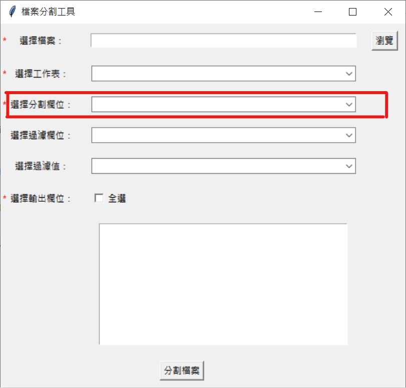
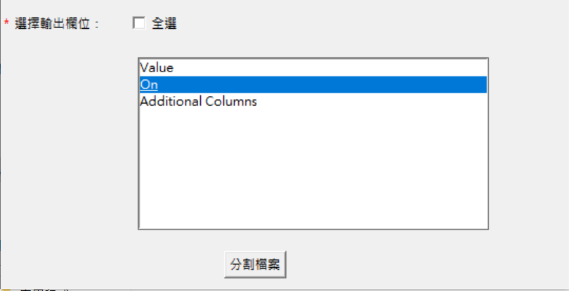
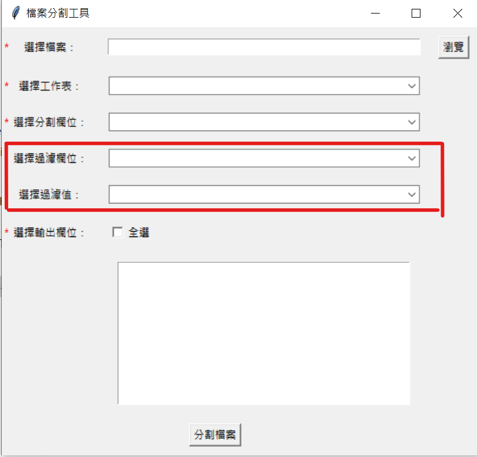

# excel-file-splitter

If you want to make an exe file:

```bash 
pyinstaller --onefile --windowed main.py 
```

## How to use
### Choose column to split

Choose a column, and this tool will split you file into multiple files by unique values of the column you chose.

### Choose column you want

You can choose columns you want for the output files. In this case, the output files will have only one column ' On'.

### Filtering value

For example, if I chose the column ' Fruit' and value ' Apple', and the output files will only have rows with ' Apple' on column ' Fruit'.